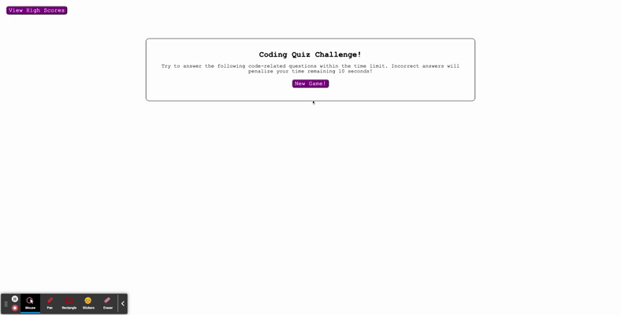

# JS Code Quiz

👉 [This application is live!](https://jonathan-warkentine.github.io/js-code-quiz/)

---

## Description
This project seeks to provide the user with an enjoyable way to test and grow their knowledge of JavaScript. The project is deployed at https://jonathan-warkentine.github.io/js-code-quiz/

## Usage

The app can be accessed via the above-listed URL.

When the app is loaded, the user is presented with a description of the gameplay. When the "New Game!" button is selected, the user is presented with the first of several coding questions to answer, and a countdown timer is displayed. If the "View High Scores" button is selected, previous scores with their respective initials are displayed, called from local storage.

For gameplay, the countdown timer continues to decrement. If an incorrect answer is selected by the user, the timer decrements 10 seconds as a penalty. A message pops up for 2 seconds to inform the user of their incorrect selection, and the next question is displayed. If the user selects the correct question, a message pops up for 2 seconds to inform them of their correct selection. No time is penalized, and the next question is displayed.

If all questions have been attempted, or if the time remaining gets to 0, then gameover screen appears with the user's score (which is simply the time remaining at the time of completion). The user has the option of submitting their score with their initials. The user can also click "Play Again" which starts the game over, or click "View High Scores," which displays the same scoring page that the button in the top left links to.

## Features

The CSS styling is responsive, adapting for viewing on mobile devices.

There a total of 16 functions in this application:
`function startGame ()` calls the functions necessary to reset all the variables and reshuffle the question deck
`function gameOver ()` stops the clock by calling the `stopClock()` function
`function runClock ()` starts a setInterval that sets the countdown timer in motion
`function stopClock()` clears the interval set in the `runClock()` function
`function populateQuizCard ()` populates the quiz card with a question and 4 possible answers
`function recordScore(event)` records the user's latest score, sorts it along with all historical scores, and takes one parameter, the submission event, to prevent the default behavior.
`function showScores ()` toggles to the high scores card and populates it with the high scores saved to local storage
`function clearScores()` removes scores from local storage and from the page
`function checkAnswer(event)` if there are no more questions, calls the `gameOver ()` function. Otherwise, checks to see if the answer is correct or incorrect, calling the `rightAnswer()` or `wrongAnswer()` functions respectively.
`function wrongAnswer ()` alerts the user that their selected answer was incorrect by calling the `popup()` function with parameter "incorrect!". Ends the game if there are 10 or less seconds left, or deducts 10 seconds from the clock if there are 11 or more seconds still remaining.
`function rightAnswer()` alerts the user that they selected the right answer.

`function removeChildNodes(parentEl)` takes the parameter "parentEl" and removes all child nodes/elements. Used to depopulate the high scores screen when the "clear scores" button is clicked.
`function randomizeArray (array)` returns a randomly sorted array provided in the function parameter, algorithm borrowed from https://stackoverflow.com/questions/2450954/how-to-randomize-shuffle-a-javascript-array
`function popup(message)` creates a popup with the message provided in the parameter
`function clearPopup()` clears any popups
`function sortScores(unsortedScores)` sorts a given unsorted array of scores from highest to lowest score, algorithm borrowed from https://www.javascripttutorial.net/array/javascript-sort-an-array-of-objects/
`

## Outstanding Updates
- [x] Highscore sorting
- [x] description of each function in Readme
- [ ] introduce a smoother popup feature with fading?
- [ ] more interesting background/styling

## License
This project is fully open source.